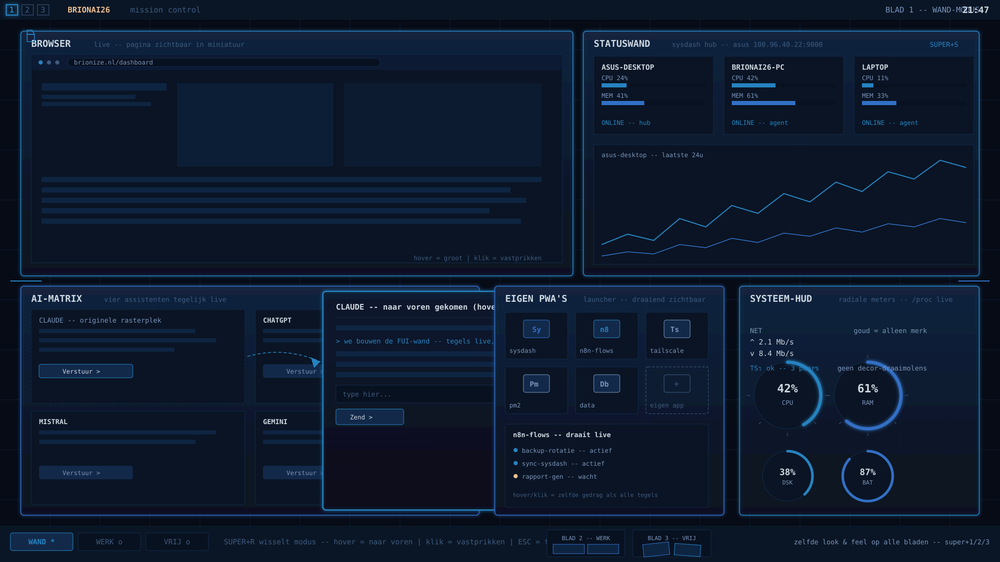

# BrionAI26 - FUI-doelplaat v2 (Command Center, 3 werkbladen)

Dit is de doorgeschakelde versie na jouw feedback: niet meer "terminals-gevoel",
maar de film-look uit jouw referentiefoto - staalblauw glas, radiale meters,
grote panelen die leven van echte data.

## Wat er veranderd is t.o.v. v1

| Onderdeel | v1 | v2 |
|---|---|---|
| Palet | goud/amber overal | staalblauw (#2683C0 / #3270C5) uit jouw referentiefoto; goud (#F0C090) ALLEEN merk |
| Schaal | kleine HUD-tegeltjes | grote glastegels: BROWSER, STATUSWAND, AI-MATRIX, EIGEN PWA'S, SYSTEEM-HUD |
| Sfeer | terminals-gevoel | mission control: radiale meters met tick-marks, curve-grafieken, glas-panelen |
| Werkbladen | 1 blad | 3 bladen, zelfde look & feel, andere standaardmodus |

## Vastgestelde besluiten (v2-basis)

1. **Palet**: staalblauw hoofdpiet (#060B16 basis, #2683C0/#3270C5 accenten,
   #CDD8E1 tekst, #7A93B8/#3E5A7E secundair). Goud #F0C090 alleen voor de
   BRIONAI26-merknaam (taakbalk, splash, GRUB, login, favicon-positie PWA's).
2. **Logo-beleid**: het gouden logo nooit als wallpaper - de wand zelf is staalblauw.
3. **Panelen**: BROWSER (live pagina zichtbaar klein, hover/klik = groot werken),
   AI-MATRIX (Claude/ChatGPT/Mistral/Gemini tegelijk klein zichtbaar, hover = naar
   voren), EIGEN PWA'S (launcher + draaiende apps klein zichtbaar), STATUSWAND
   (3 machines + 24u-grafiek), SYSTEEM-HUD (4 radiale meters, /proc live).
4. **Geen cilinder in het midden** - panelen vullen de wand, geen draaimolen.
5. **Tegelgedrag**: hover = naar voren/groot, klik = vastprikken, Esc/klik-buiten =
   terug. Op de PWA-laag hetzelfde principe via CSS.
6. **Werkbladmodellen**: blad 1 = WAND (klein + hover-uitbreiding), blad 2 = WERK
   (grote tegels, geen hover), blad 3 = VRIJ (los van raster). Zelfde look & feel
   op alle bladen; Super+R wisselt modus.
7. **Echte data of niets**: elk bewegend element toont echte data (Conky /proc,
   SysDash-hub, PM2/n8n, tailscale). Geen nep-datastromen.

## Scherpte / HD

De doelplaat is een SVG (vector): oneindig schaalbaar, messcherp op elke
monitorresolutie. Het echte bureaublad rendert eveneens op native resolutie.
Open de SVG in de browser en zoom gerust in - geen korrel.
