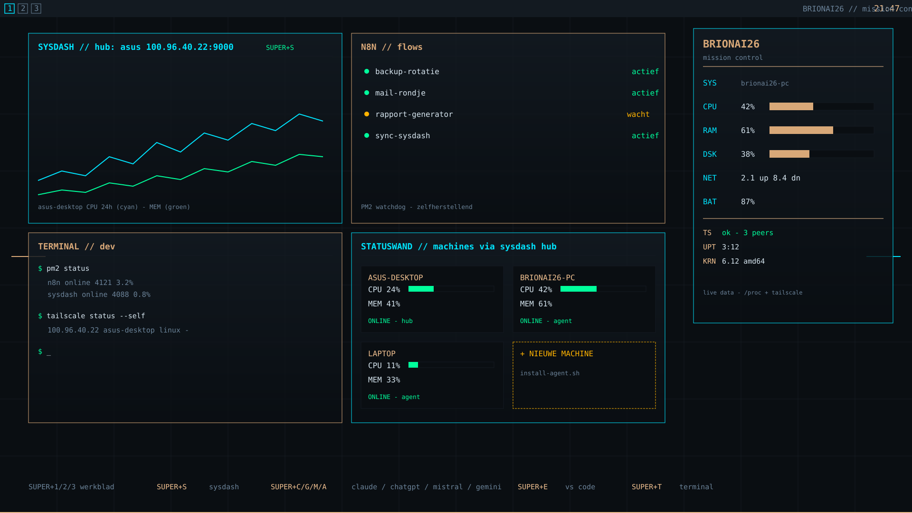

# BrionAI26 — FUI-doelplaat (Command Center, werkblad 1)

Dit is de visuele referentie voor de mission-control-look: donkere basis,
subtil raster, glastegels met dunne lichtende randen, monospace-HUD-tekst
en alléén echte data (Conky /proc, SysDash-hub, terminal, PM2/n8n).

## De doelplaat

## Wat je ziet

| Tegel | Kleurrand | Data-bron |
|---|---|---|
| SYSDASH | cyan | echte hub op de Asus (100.96.40.22:9000) via Super+S |
| N8N // flows | goud | echte PM2-processtatus (zichtbaar in Dev Studio) |
| TERMINAL // dev | goud | echte terminal (Super+T) |
| STATUSWAND | cyan | echte metrics van alle machines via de sysdash-hub |
| BRIONAI26 HUD | cyan | Conky: /proc + tailscale (bestaat al, fase 2) |

## FUI-grondregels (vastgesteld in overleg)

1. Donkere basis #0A0E12, subtil raster — geen logo-muur.
2. Tegels zijn glaspanelen met 1px lichtende rand: cyan = data, goud = branding/apps.
3. Monospace-typografie met // -scheidingslijnen en korte labels.
4. Elk bewegend element toont échte data — geen nep-datastromen (geen "fuigetry").
5. Hotkeys zijn zichtbaar op het scherm zelf (FUI toont zijn eigen bediening).

Deze branch is alleen een kijk-branch: niet bedoeld om te mergen.
